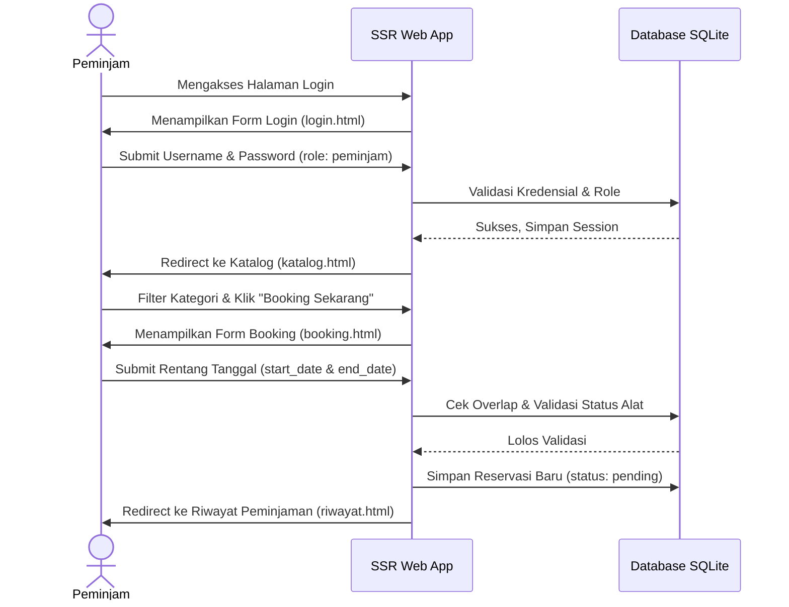
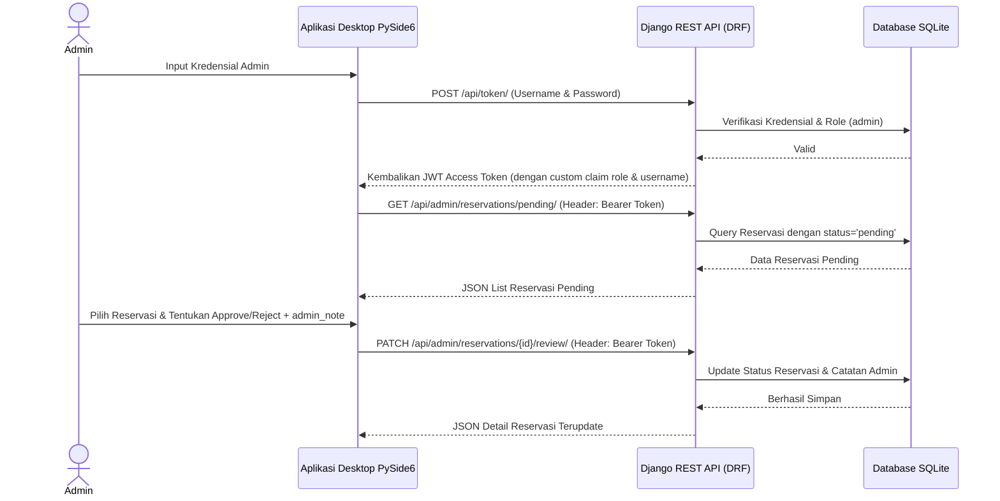

# AsetKita - Sistem Peminjaman Aset Sekolah

AsetKita adalah platform manajemen dan peminjaman aset/alat sekolah (misalnya Proyektor, Kamera DSLR, Alat Olahraga, dll.) yang dirancang dengan sistem dual-interface:
1. **SSR Web App (untuk Peminjam/Guru/Siswa)**: Aplikasi web berbasis Server-Side Rendering (SSR) untuk menjelajahi katalog alat, melakukan pemesanan (booking), dan melihat riwayat status peminjaman.
2. **REST API (untuk Admin/Desktop PySide6)**: API Web terenkripsi berbasis token JWT (JSON Web Token) yang disediakan untuk dikonsumsi oleh aplikasi Desktop Admin berbasis **PySide6** untuk melakukan peninjauan (Approve/Reject) reservasi.

---

## 🏗️ Arsitektur & Alur Aplikasi (Application Flow)

AsetKita menggunakan arsitektur pemisahan hak akses berbasis **Role-Based Access Control (RBAC)** antara `peminjam` dan `admin`.

### 1. Alur Peminjam (SSR Web App)


### 2. Alur Admin (PySide6 Desktop Client via REST API)


### 3. Logika Bisnis Utama: Pencegahan Double-Booking (Overlap)
Aplikasi ini melarang adanya dua peminjaman aktif untuk alat yang sama pada rentang tanggal yang saling bertabrakan.
*   **Status yang memicu bentrok**: `pending`, `approved`, `ongoing`.
*   **Status yang diabaikan**: `rejected`, `completed`.
*   **Rumus Irisan Tanggal (Overlap)**:
    $$\text{Bentrok jika: } (\text{start\_date} \le \text{existing\_end\_date}) \text{ AND } (\text{end\_date} \ge \text{existing\_start\_date})$$

Logika ini diterapkan ganda untuk integritas data maksimum:
1.  **Level Database/Model**: Diterapkan pada fungsi `clean()` di dalam [Reservation](file:///e:/Project%20App/python-django-pyside6/assets/models.py#L31-L139).
2.  **Level API/Serializer**: Diterapkan pada fungsi `validate()` di dalam [ReservationSerializer](file:///e:/Project%20App/python-django-pyside6/assets/serializers.py#L43-L90).

---

## 📂 Struktur Folder dan Fungsi File

Berikut adalah rincian lengkap mengenai kegunaan berkas dan direktori yang ada pada proyek ini:

```text
python-django-pyside6/
├── core/                       # Folder Utama Proyek Django (Konfigurasi & Routing)
│   ├── __init__.py
│   ├── asgi.py                 # Konfigurasi server asinkronus (ASGI)
│   ├── settings.py             # Pusat pengaturan proyek Django
│   ├── urls.py                 # Registrasi URL Routing utama (Web App & REST API)
│   └── wsgi.py                 # Konfigurasi server sinkronus (WSGI)
│
├── users/                      # App Django khusus Autentikasi & Akun Pengguna
│   ├── migrations/             # Berkas migrasi skema tabel User ke database
│   ├── __init__.py
│   ├── admin.py                # Pendaftaran CustomUser ke Admin Panel Django
│   ├── apps.py                 # Konfigurasi aplikasi users
│   ├── models.py               # Custom User Model (Menambahkan Field Role: admin/peminjam)
│   ├── tests.py                # Unit test untuk model User
│   └── views.py                # View terkait user (opsional)
│
├── assets/                     # App Django inti manajemen Alat & Peminjaman (Reservasi)
│   ├── migrations/             # Berkas migrasi tabel Asset dan Reservation
│   ├── __init__.py
│   ├── admin.py                # Pendaftaran Asset & Reservation ke Admin Panel Django
│   ├── api_views.py            # API controller untuk dikonsumsi oleh aplikasi PySide6 Desktop
│   ├── apps.py                 # Konfigurasi aplikasi assets
│   ├── forms.py                # Django Form dengan styling bootstrap untuk booking alat
│   ├── models.py               # Model Asset & Reservation + Logika Overlap Booking
│   ├── permissions.py          # Custom Permission class (Hanya Role Admin yang bisa akses API)
│   ├── serializers.py          # Serializer DRF & Custom Payload Token JWT
│   ├── tests.py                # Kumpulan Integration & Unit Tests (Validasi logis terlengkap)
│   └── views.py                # Class-Based Views untuk SSR Web App peminjam
│
├── templates/                  # Folder Template HTML (SSR Front-End)
│   └── assets/                 # Berkas-berkas HTML dengan desain premium & modern
│       ├── base.html           # Struktur dasar HTML, CSS Variables, Glassmorphic Navbar & Footer
│       ├── login.html          # Halaman Login Glassmorphism
│       ├── katalog.html        # Katalog Aset Sekolah dengan filter kategori
│       ├── booking.html        # Form Pengajuan Peminjaman Alat
│       └── riwayat.html        # Riwayat Peminjaman (menampilkan status & catatan admin)
│
├── db.sqlite3                  # Database lokal SQLite3
└── manage.py                   # CLI Utility untuk menjalankan perintah Django
```

### Penjelasan Detail Berkas Penting

1.  **[core/settings.py](file:///e:/Project%20App/python-django-pyside6/core/settings.py)**:
    *   Mengintegrasikan modul pihak ketiga seperti `rest_framework` dan `rest_framework_simplejwt`.
    *   Menetapkan model user default ke custom user `users.CustomUser`.
    *   Mengatur konfigurasi token JWT (SimpleJWT) dengan payload kustom melalui serializer `CustomTokenObtainPairSerializer`.
2.  **[core/urls.py](file:///e:/Project%20App/python-django-pyside6/core/urls.py)**:
    *   Memisahkan rute halaman web SSR (seperti `/katalog/`, `/booking/`, `/riwayat/`) dengan rute REST API Admin (seperti `/api/token/`, `/api/admin/reservations/pending/`, `/api/admin/reservations/<id>/review/`).
3.  **[users/models.py](file:///e:/Project%20App/python-django-pyside6/users/models.py)**:
    *   Mendefinisikan model `CustomUser` yang mewarisi `AbstractUser` dari Django, menambahkan atribut `role` dengan pilihan `admin` atau `peminjam` guna memfasilitasi otentikasi dual-interface.
4.  **[assets/models.py](file:///e:/Project%20App/python-django-pyside6/assets/models.py)**:
    *   `Asset`: Menyimpan informasi nama, kategori, nomor seri, status ketersediaan (`available`, `maintenance`, `broken`), dan deskripsi.
    *   `Reservation`: Menyimpan data peminjaman aset oleh user tertentu pada jangka waktu tertentu.
    *   Memiliki fungsi `check_overlap` untuk melakukan kalkulasi bentrok tanggal dan `clean()` untuk memastikan data bersih sebelum disimpan (`save()`).
5.  **[assets/views.py](file:///e:/Project%20App/python-django-pyside6/assets/views.py)**:
    *   `PeminjamRequiredMixin`: Membatasi agar user dengan role `admin` tidak bisa menyelinap masuk ke halaman SSR Web App. Jika admin terdeteksi, session web-nya akan otomatis dilogout dan diarahkan kembali ke login.
    *   `AssetCatalogView`: Menyaring barang yang siap digunakan (`status='available'`) dan menyediakan kategori unik untuk filtering dinamis.
    *   `ReservationCreateView`: Menyimpan booking dengan menetapkan relasi user otomatis ke pembuat request yang sedang login.
6.  **[assets/api_views.py](file:///e:/Project%20App/python-django-pyside6/assets/api_views.py)**:
    *   `PendingReservationsAPIView`: Mengembalikan JSON berisi daftar reservasi yang sedang menunggu keputusan (status: `pending`).
    *   `ReviewReservationAPIView`: API endpoint bagi admin untuk merubah status peminjaman menjadi `approved` atau `rejected` secara parsial (`PATCH`) maupun menyeluruh (`PUT`) beserta kewajiban menyisipkan `admin_note`.
7.  **[assets/serializers.py](file:///e:/Project%20App/python-django-pyside6/assets/serializers.py)**:
    *   `CustomTokenObtainPairSerializer`: Menyisipkan klaim data `role` dan `username` langsung di dalam token JWT, sehingga aplikasi desktop PySide6 dapat langsung mengetahui profil pengguna yang sedang login tanpa perlu menembak endpoint profil tambahan.
    *   `ReservationSerializer` & `ReservationReviewSerializer`: Menangani serialisasi data mentah ke JSON sekaligus menjamin keamanan logika double-booking menggunakan validasi bawaan serializer.
8.  **[assets/permissions.py](file:///e:/Project%20App/python-django-pyside6/assets/permissions.py)**:
    *   `IsAdminUserRole`: Kelas otorisasi khusus yang membatasi hak akses endpoints API agar hanya dapat dieksekusi oleh pengguna yang terbukti memiliki role `'admin'`.
9.  **[templates/assets/base.html](file:///e:/Project%20App/python-django-pyside6/templates/assets/base.html)**:
    *   File template dasar yang menerapkan visual bertema **Dark-Mode dengan Glassmorphism** (menggunakan backdrop blur, gradien neon ungu-merah muda, serta Font modern Google 'Outfit').

---

## 🛠️ Panduan Menjalankan Proyek (Setup Guide)

### 1. Prasyarat (Prerequisites)
Pastikan Anda sudah menginstal Python 3.10+ di komputer Anda.

### 2. Instalasi Dependensi
Jalankan perintah berikut di terminal Anda untuk menginstal Django dan library yang diperlukan:
```bash
pip install django djangorestframework djangorestframework-simplejwt
```

### 3. Migrasi Database & Seed Data (Opsional)
Jalankan migrasi untuk membuat tabel-tabel database:
```bash
python manage.py migrate
```

### 4. Membuat Akun Pengguna (Superuser / Admin / Peminjam)
Untuk menguji kedua sisi (Web SSR & Desktop PySide6 API), Anda dapat membuat akun melalui Django Shell:
```bash
python manage.py shell
```
Kemudian di dalam shell Python, jalankan perintah berikut:
```python
from users.models import CustomUser

# 1. Membuat akun Peminjam (untuk Web App)
CustomUser.objects.create_user(username='peminjam1', password='password123', role='peminjam')

# 2. Membuat akun Admin (untuk Desktop PySide6 API)
CustomUser.objects.create_user(username='admin1', password='password123', role='admin', is_staff=True, is_superuser=True)

exit()
```

### 5. Menjalankan Server
Jalankan server lokal Django dengan perintah:
```bash
python manage.py runserver
```
*   Akses halaman web **Peminjam** di: `http://127.0.0.1:8000/`
*   Akses halaman **Django Admin** di: `http://127.0.0.1:8000/django-admin/`
*   Endpoint **REST API Auth** di: `http://127.0.0.1:8000/api/token/`
*   Endpoint **REST API Admin** di: `http://127.0.0.1:8000/api/admin/reservations/pending/`

### 6. Menjalankan Pengujian Otomatis (Testing)
Untuk memastikan seluruh logika overlap booking dan hak akses berjalan dengan benar, Anda dapat menjalankan unit testing bawaan:
```bash
python manage.py test assets
```
